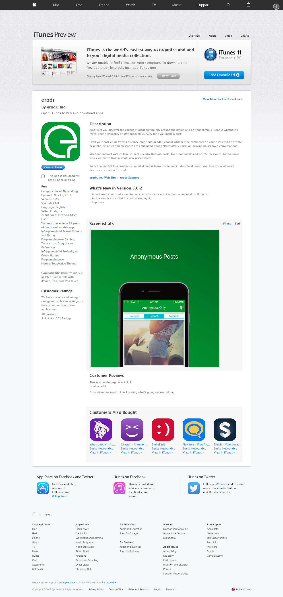

# erodr Archive

A defunct LOCAL social app built by two University of Missouri students in the 20teens.

**From the description of its [Facebook page](https://www.facebook.com/erodrapp)**:

> erodr lets you discover the college student community around the nation and on your campus. Choose whether to reveal your personality or stay anonymous every time you make a post.
>
> Limit your post visibility by a distance range and gender, choose whether the comments on your posts will be private or public. All posts and messages are ephemeral, thus deleted after expiration, leaving no archived conversations.
>
> Meet and interact with college students nearby through posts, likes, comments and private messages. Get to know your classmates from a whole new perspective!
>
> To get connected to a large open-minded and inclusive community - download erodr now. A new way of social discovery is waiting for you!

## Living Links

* [Facebook Page](https://www.facebook.com/erodrapp)
* [Twitter Profile](https://twitter.com/erodrapp)
* [Get Erodr! : Rolla](https://www.reddit.com/r/Rolla/comments/21lejp/get_erodr/)

### Archived

* [erodr.com](http://web.archive.org/web/20130414025715/http://erodr.com/#)
* [Google Play Store](http://web.archive.org/web/20150314211524/https://play.google.com/store/apps/details?id=com.erodr.erodr#) - `https://play.google.com/store/apps/details?id=com.erodr.erodr`
* [Apple App Store](http://web.archive.org/web/20170216050044/https://itunes.apple.com/us/app/erodr/id575044187) - `https://itunes.apple.com/us/app/erodr/id575044187`

## Misc Social Images

</img> </img> </img> </img> </img> </img> </img> </img> </img> </img> </img> </img> </img> </img> </img> </img> </img> </img> </img> </img> </img> </img> </img> </img> </img> </img> </img> </img> </img> </img> 

